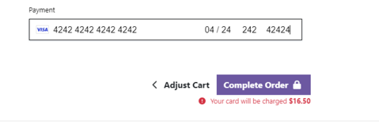
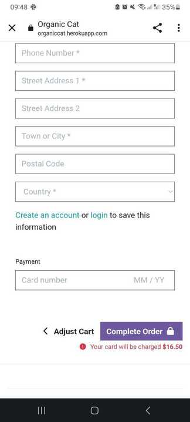
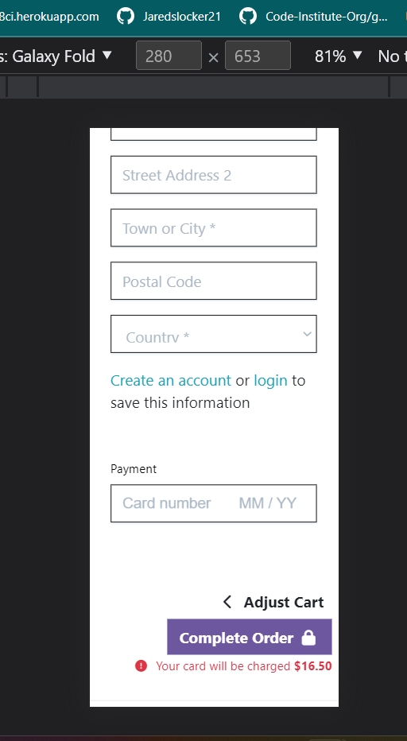

## This is a Document to display tests such as 
* Navigation Links
* Footer Link 
* Py Linter Validator
* Lighthouse Page Analayzer 
* HTML Validator
* CSS Validator

## Navigation Links
All of these links were tested by myself, friends, close and far and passed. 

 * Home - index.html and base.html
 * All Products - products.html
 * Food - django template drop down menu
 * Accessories - djangop templates  all drop down items work
 * Toys - django templates and all drop down work
 * Offers -  django templates and all drop downs work
 * Search Menu - Searches All Product names and descriptions
 * My Account - drop down menu's pictures in  [README.md](README.md)
 * Cart - Button works and redirects too cart 

 ## Footer Links 
 All footer Links were tested and open to another tab with their respective URL 

  * Privacy Policy 
  * Terms and Conditions
  * Delivery Policy
  * FACEBOOK
  * TWITTER 
  * INSTAGRAM
  * YOUTUBE
  * LINKED IN 
  * GITHUB

  ## Testing
Some Hours Prior to Submission I noticed that on my phone has no credit card input field.
3/28/2023 at 10:59 

I had Tutor support and Daisy Mc Girr test Web and Mobile with no errors or problems-

Making me nervous

## Security Tests are located in the [README.md](README.md) File under the Security Tests Section.

## Testing messages coinside with the displays in the [README.md](README.md) Alert Section.

### Py Linter

All pythone pages were run through the official [Code Institute Python Linter](https://pep8ci.herokuapp.com/) validator to ensure all code was pep8 compliant. Some errors were shown due to blank spacing and lines too long, 1 line instead of 2 expected. All of these errors were resolved and code passed through validators.
 
 * admin.py 

 All passed 

| checkout | [CI Py linter](docs/test_images/checkout-admin-lint.png)

| contact | [CI Py linter](docs/test_images/contact-admin-lint.png)

| offers | [CI Py linter](docs/test_images/offers-admin-lint.png)

| products | [CI Py linter](docs/test_images/products-admin-lint.png)

| reviews | [CI Py linter](docs/test_images/reviews-admin.png)
 
 * apps.py

 All passed 

| checkout | [CI Py linter](docs/test_images/checkout-apps-lint.png)

| contact | [CI Py linter](docs/test_images/contact-apps-lint.png)

| products | [CI Py linter](docs/test_images/product-apps-lint.png)

| profiles |[CI Py linter](docs/test_images/profile-apps-lint.png)

| reviews | [CI Py linter](docs/test_images/reviews-apps-lint.png)

 * forms.py

| checkout | [CI Py linter](docs/test_images/formspy.png)

| contact | [CI Py linter](docs/test_images/checkout-forms-lint.png)

| product | [CI Py linter](docs/test_images/product-forms-lint.png)

| profile | [CI Py linter](docs/test_images/profiles-forms-lint.png)

| reviews | [CI Py linter](docs/test_images/reviews-forms-lint.png)

* urls.py

All passed 
 
| cart | [CI Py linter](docs/test_images/linter-urls-cart.png)

| checkout | [CI Py linter](docs/test_images/checkout-forms-lint.png)

| contact | [CI Py linter](docs/test_images/checkout-urls-lint.png)

| ecom | [CI Py linter](docs/test_images/)

| home | [CI Py linter](docs/test_images/home-urls-lint.png)

| products | [CI Py linter](docs/test_images/products-urls-lint.png)

| profiles |[CI Py linter](docs/test_images/profiles-urls-lint.png)

| reviews | [CI Py linter](docs/test_images/reviews-urls-lint.png)

* models.py 

All passed 
 
| cart | [CI Py linter](docs/test_images/adminpy.png)

| checkout | [CI Py linter](docs/test_images/checkout-models-lint.png)

| contact | [CI Py linter](docs/test_images/checkout-models-lint.png)

| offers | [CI Py linter](docs/test_images/offers-models-lint.png)

| products | [CI Py linter](docs/test_images/products-models-lint.png)

| profiles |[CI Py linter](docs/test_images/profile-models-lint.png)

| reviews | [CI Py linter](docs/test_images/reviews-models-lint.png)

* views.py 

All passed 
 
| cart | [CI Py linter](docs/test_images/views-linter-cart.png)

| checkout | [CI Py linter](docs/test_images/checkout-views-lint.png)

| contact | [CI Py linter](docs/test_images/contact-views-lint.png-views-lint.png)

| home | [CI Py linter](docs/test_images/home-views-lint.png)

| products | [CI Py linter](docs/test_images/products-views-lint.png)

| profiles |[CI Py linter](docs/test_images/profile-views-lint.png)

| reviews | [CI Py linter](docs/test_images/reviews-views-lint.png)

* widgets.py 

| products widgets | [CI Py linter](docs/test_images/products-widgets-lint.png)

* context.py

| cart | [CI Py linter](docs/test_images/contextcart.png)

* test.py

| Home | [CI Py linter](docs/test_images/home-test-lint.png)

* settings.py

| ecom | [CI Py linter](docs/test_images/ecom-settings-lint.png)

* stripe webhooks in checkout

| stripe webhooks | [CI Py linter](docs/test_images/checkout-webhooks-lint.png)

## Lighthouse Performance

Light house Performance was generally the same with all urls.

| Home| [Lighthouse Validator](docs/test_images/lighthouse/lighthousescore.png)

## HTML Validator 

All pages were run through the [w3 HTML Validator](https://validator.w3.org/). Initially there were some errors due to stray script tags, misuse of headings within spans and some unclosed elements. All of these issues were corrected and all pages passed validation.

Due to the django templating language code used in the HTML files, these could not be copy and pasted into the validator and due to the secured views, pages with login required or a secured view cannot be validated by direct URI. To test the validation on the files, open the page to validate, right click and view page source. Paste the raw html code into the validator as this will be only the HTML rendered code.

All Passed 

| Home Page | [Home Page Validation](https://validator.w3.org/nu/?showsource=yes&doc=https%3A%2F%2Forganiccat.herokuapp.com%2F#l133c45) |

| Privacy Page | [Privacy Page Validation](https://validator.w3.org/nu/?showsource=yes&doc=https%3A%2F%2Forganiccat.herokuapp.com%2Fprivacy%2F#l133c45) |

| Terms & Conditions Page | [Terms & Conditions Page Validation](https://validator.w3.org/nu/?showsource=yes&doc=https%3A%2F%2Forganiccat.herokuapp.com%2Fterms%2F#l133c45) |

| Delivery Policy Page | [Delivery Page Validation](https://validator.w3.org/nu/?showsource=yes&doc=https%3A%2F%2Forganiccat.herokuapp.com%2Fdelivery%2F#l133c45) |

| Contact Form Page | [Contact Form Page Validation](https://validator.w3.org/nu/?showsource=yes&doc=https%3A%2F%2Forganiccat.herokuapp.com%2Fcontact%2F#l133c45)|

| Contact Form Success Page| [Contact Success Page Validation](https://validator.w3.org/nu/?showsource=yes&doc=https%3A%2F%2Forganiccat.herokuapp.com%2Fcontact%2F#textarea) |

| Product Page | Pass | [Product Page Validation](https://validator.w3.org/nu/?showsource=yes&doc=https%3A%2F%2Forganiccat.herokuapp.com%2Fproducts%2F#l133c45) |

| Product Detail Page |  [Product Detail Page](https://validator.w3.org/nu/?showsource=yes&doc=https%3A%2F%2Forganiccat.herokuapp.com%2Fproducts%2F39%2F) |

| Profile Page | [Profile Page Validation](https://validator.w3.org/nu/?showsource=yes&doc=https%3A%2F%2Forganiccat.herokuapp.com%2Fprofile%2F) |

| Cart Page | [Cart Page Validation](https://validator.w3.org/nu/?showsource=yes&doc=https%3A%2F%2Forganiccat.herokuapp.com%2Fcart%2F) |

| Checkout Page | [Checkout Page Validation](https://validator.w3.org/nu/?showsource=yes&doc=https%3A%2F%2Forganiccat.herokuapp.com%2Fcheckout%2F) |

| Checkout Success Page | [Checkout Success Page](https://validator.w3.org/nu/?showsource=yes&doc=https%3A%2F%2Forganiccat.herokuapp.com%2Fcheckout%2Fcheckout_success%2F04EA3500312545ECB90C5DEF866F18BD) |

| 404 Error Page | [404 Page Validation](https://validator.w3.org/nu/?showsource=yes&doc=https%3A%2F%2Forganiccat.herokuapp.com%2Fsdf#textarea) |

| Add Product Page |[Add Product Page Validation](https://validator.w3.org/nu/?showsource=yes&doc=https%3A%2F%2Forganiccat.herokuapp.com%2Fproducts%2Fadd%2F) |

| Edit Product Page | [Edit Product Page Validation](https://organiccat.herokuapp.com/products/edit/58/) |

| Accounts login Page | [Edit Product Page Validation](https://validator.w3.org/nu/?showsource=yes&doc=https%3A%2F%2Forganiccat.herokuapp.com%2Faccounts%2Flogin%2F) |

## CSS Validator

* CSS Validator

All passed

| base.css | [CSS validator w3](docs/test_images/css/css-base.png)

| checkout.css | [CSS validator w3](docs/test_images/css/css-checkout.png/)

| profile.css | [CSS validator w3](docs/test_images/css/css-profile.png)

# Modile Views Capturing Screenshotes while Testing

* [Nav Search Test](docs/readme_images/mobile/nav-search.PNG)
* [Product Page Test](docs/readme_images/mobile/product-page.PNG)
* [Product Detail Test](docs/readme_images/mobile/product-detail.PNG)
* [Cart Test](docs/readme_images/mobile/)
* [Checkout Form Test](docs/readme_images/mobile/checkout-form.PNG)
* [Checkout Test](docs/readme_images/mobile/checkout-form.PNG)S
* [empty-cart Test](docs/readme_images/mobile/empty-cart.PNG)
* [Profile TEst](docs/readme_images/mobile/)
* [Reviews](docs/readme_images/mobile/)
* [toasts](docs/readme_images/mobile/)
* [inventory-error-toast](docs/readme_images/mobile/)
* [Add-to-Cart-success](docs/readme_images/mobile/)
* [Account Icons](docs/readme_images/mobile/)
* [toast](docs/readme_images/mobile/)
* [contact us form](docs/readme_images/mobile/)

